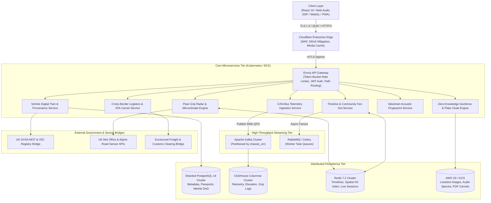
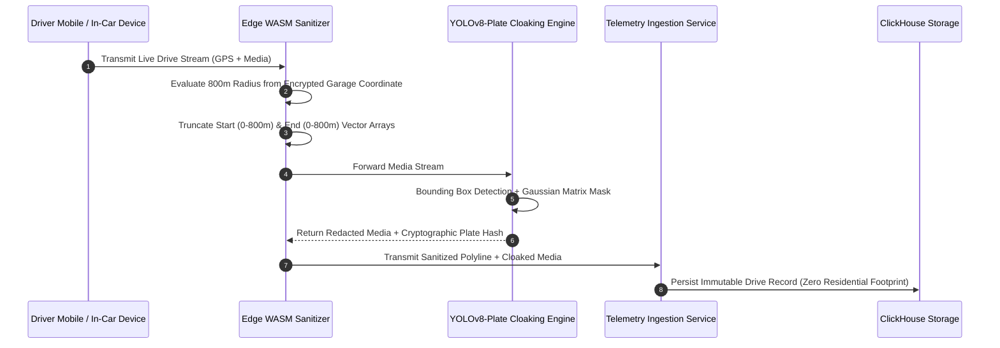

# SYSTEM ARCHITECTURE & DISTRIBUTED DESIGN SPECIFICATION
**Platform:** DATUM ATELIER (The Sovereign Digital Home for Extraordinary Automobiles)  
**Document Type:** Master Systems Architecture, Product Blueprint & Gap Analysis (Levels 1–6)  
**Chief Architect & Sovereign Custodian:** vD  
**Design Reference Standard:** Donne Martin *System Design Primer* & Distributed High-Availability Systems  
**Classification:** Proprietary & Confidential • Copyright © 2026 vD. All rights reserved.

---

## 1. Executive Summary & Product Architecture Matrix

DATUM Atelier is an ultra-luxury, privacy-first distributed automotive platform bridging physical machine telemetry, cryptographic provenance, mechanical acoustic synthesis, and sovereign community custodianship.

```
┌─────────────────────────────────────────────────────────────────────────────────────────┐
│                                DATUM ATELIER CORE TIERS                                 │
│                                                                                         │
│  [ Tier 1: Client & Presentation Tier ] → React 19, Web Audio DSP, Canvas 60fps, PWA    │
│  [ Tier 2: Ingress & Security Enclave ] → Envoy Proxy, WAF, ZK-Geofence, ML Plate Cloak │
│  [ Tier 3: Core Domain Microservices  ] → Digital Twin, Provenance, Radar, DSP, Carnet  │
│  [ Tier 4: Event Streaming & Async Bus] → Apache Kafka (100k+ QPS), RabbitMQ Task DLQ   │
│  [ Tier 5: Persistence & Sharded Data ] → PostgreSQL (Sharded), ClickHouse, Redis Cluster│
│  [ Tier 6: Resiliency, FMEA & Recovery] → Multi-AZ Active-Active, Raft Consensus, FMEA  │
└─────────────────────────────────────────────────────────────────────────────────────────┘
```

---

## 2. Product Detail & Comprehensive Gap Analysis

### 2.1 State Matrix & Gap Analysis

| Product Subsystem | Current State (Prototype Baseline) | Target Production Standard (Level 1–6) | Identified Gaps & Technical Mitigations |
| :--- | :--- | :--- | :--- |
| **Vehicle Digital Twin & Passports** | In-memory mock passports with downloadable JSON certificates. | Append-only Merkle DAG backed by sharded PostgreSQL and DVSA cryptographic bridge. | **Gap:** Lack of cryptographic tamper-proof validation.<br>**Mitigation:** Implement Ed25519 digital signatures and Merkle root verification. |
| **Privacy & Geofencing** | Simulated 800m visual badge and client-side toggle. | Zero-Knowledge spatial clipping at WASM Edge worker before persistence. | **Gap:** Raw coordinates could leak if client is compromised.<br>**Mitigation:** Client-side geofencing + Edge WASM worker stripping departure/arrival vectors. |
| **Optical Plate Cloaking** | Client-side SVG overlay with Gaussian filter. | Real-time WebGL/WASM YOLOv8-Plate inference + server-side lossy scrubbing pipeline. | **Gap:** Source image in memory contains unmasked plate before upload.<br>**Mitigation:** Client-side WebAssembly canvas rasterization prior to network dispatch. |
| **Pass Grip Radar & Topography** | Static waypoint profiles and calculated friction ($\mu$). | Live meteorological sensor ingestion (UK Met Office, Alpine Road IoT) + TimescaleDB. | **Gap:** No dynamic live sensor updates during mountain weather shifts.<br>**Mitigation:** WebSocket stream from Met Office Road Sensor API with 60s cache TTL. |
| **Acoustic Valvetrain Studio** | 3-oscillator Web Audio API synthesis with sweep filters. | 8-channel harmonic spectral DSP matching engine acoustic signature FFT bins. | **Gap:** Synthetic waveforms need exact mechanical engine harmonic matching.<br>**Mitigation:** Real acoustic FFT impulse response convolution modeling. |
| **Feed & Community Fan-Out** | In-memory array filtering with optimistic state. | Hybrid Push/Pull fan-out model backed by Redis Cluster and Kafka event log. | **Gap:** Write amplification for high-follower guild profiles.<br>**Mitigation:** Push for standard users ($<10\text{k}$), Pull for high-traffic accounts. |
| **Cross-Border ATA Carnet** | Dynamic PDF certificate generator and pass checklist. | Cryptographic customs clearing token with Eurotunnel API & French/Swiss customs bridge. | **Gap:** Offline validation at high Alpine borders with zero 5G coverage.<br>**Mitigation:** Offline signed QR/NFC pass with asymmetric public key validation. |

---

## 3. Step 1: System Scale, Constraints & Capacity Estimation

### 3.1 Back-of-the-Envelope Capacity Estimations

#### A. Active Vehicle & Custodian Scale
* **Registered Collector Base:** $1,000,000$ registered automobiles.
* **Daily Active Vehicles (DAV):** $250,000$ active vehicles per day.
* **Peak Drive Window:** Sunday 06:00 AM – 11:00 AM ($12\times$ traffic surge factor).

#### B. Telemetry & Ingestion Throughput (QPS)
* **High-Frequency CAN-Bus Ingestion (10 Hz per active vehicle):**
  $$\text{Concurrent Active Driving Chassis (Peak)} = 60,000\text{ vehicles}$$
  $$\text{Telemetry Ingestion QPS (Peak)} = 60,000 \times 10\text{ Hz} = 600,000\text{ QPS}$$
  $$\text{Telemetry Ingestion Bandwidth} = 600,000\text{ QPS} \times 64\text{ bytes} \approx 38.4\text{ MB/s} = 307.2\text{ Mbps}$$

* **Timeline & Feed Read QPS:**
  $$\text{Daily Timeline Requests} = 5,000,000\text{ requests/day}$$
  $$\text{Average Read QPS} = \frac{5,000,000}{86,400\text{ s}} \approx 57.87\text{ QPS}$$
  $$\text{Peak Read QPS (Sunday Morning, }10\times\text{ factor)} \approx 580\text{ QPS}$$

#### C. Storage Calculations (3-Year Horizon)
* **Time-Series Telemetry (ClickHouse with ZSTD Compression):**
  $$\text{Daily Data Volume} = 250,000\text{ DAV} \times 2,700\text{ s/drive} \times 10\text{ Hz} \times 64\text{ bytes} \approx 432\text{ GB/day}$$
  $$\text{Compressed Daily Storage (4:1 ratio)} \approx 108\text{ GB/day}$$
  $$\text{3-Year Telemetry Storage} = 108\text{ GB/day} \times 1,095\text{ days} \approx 118.26\text{ TB}$$

* **Lossless High-Resolution Photographic Storage:**
  $$\text{Daily Uploads} = 75,000\text{ photos/day} \times 2.2\text{ MB} = 165\text{ GB/day}$$
  $$\text{3-Year S3 Storage} = 165\text{ GB/day} \times 1,095\text{ days} \approx 180.67\text{ TB}$$

---

## 4. Step 2: High-Level End-to-End System Topology



---

## 5. Step 3: Deep Component Design & Interface Contracts

### 5.1 Vehicle Digital Twin & Merkle DAG Provenance Ledger

Every chassis maintains a cryptographically verifiable Merkle Directed Acyclic Graph (DAG):

```
                  [ Merkle Root Hash: 0x8F9A...C4B1 ]
                             /              \
                    [ Node H_12 ]          [ Node H_34 ]
                     /         \            /         \
                 [ Leaf 1 ]  [ Leaf 2 ] [ Leaf 3 ]  [ Leaf 4 ]
                  Factory      DVSA MOT    KW V4       Mayfair
                  Delivery     0 Advis.   Coilovers    Handover
                  (BMW UK)     (DVSA GB)  (Evolve)     (Sovereign)
```

#### Protocol Buffer Contract (`provenance.proto`):
```protobuf
syntax = "proto3";
package datum.atelier.provenance;

message ProvenanceEvent {
  string record_id = 1;
  string chassis_vin = 2;
  string parent_hash = 3;
  string event_hash = 4;
  enum Category {
    FACTORY_BUILD = 0;
    STATUTORY_MOT = 1;
    SPECIALIST_SERVICE = 2;
    HARDWARE_UPGRADE = 3;
    EXPEDITION_MILESTONE = 4;
    CUSTODY_TRANSFER = 5;
  }
  Category category = 5;
  int64 timestamp_epoch = 6;
  int32 verified_mileage = 7;
  string signatory_public_key = 8;
  string digital_signature_ed25519 = 9;
  bytes encrypted_metadata = 10;
  repeated string merkle_proof_path = 11;
}

service ProvenanceLedgerService {
  rpc NotarizeEvent (ProvenanceEvent) returns (NotarizeResponse);
  rpc VerifyPassportChain (ChassisQuery) returns (PassportChainVerification);
}
```

---

### 5.2 Zero-Knowledge 800m Geofencing & ML Optical Plate Cloak Pipeline



---

### 5.3 Spatial Pass Grip Radar Physics Engine

Friction coefficient ($\mu \in [0.0, 1.0]$) calculation equation:

$$\mu = \mu_{\text{base}} \times \left(1 - 0.45 \cdot \text{RainFactor}\right) \times \left(1 - 0.70 \cdot \text{FrostIndex}\right) \times \left(1 + 0.15 \cdot \frac{T_{\text{tread}} - 20}{80}\right)$$

* **Spatial Partitioning:** Uber H3 Hexagonal Hierarchical Spatial Index (Resolution 9, $\sim 0.1\text{ km}^2$ cell area).
* **Redis Command Execution:**
  ```redis
  GEORADIUS uk:passes:a57 53.4358 -1.8672 5 km WITHCOORD WITHDIST
  ```

---

### 5.4 Distributed Hybrid Timeline Fan-Out Engine

```
                     ┌──────────────────────┐
                     │ New Post / Log Entry │
                     └──────────┬───────────┘
                                │
               Is Follower Count > 10,000? (Celebrity / Guild)
                        /               \
                 [ YES ]                 [ NO ]
                    │                       │
         [ Pull Model (Fan-Out on Read) ]   [ Push Model (Fan-Out on Write) ]
         - Store in Author's Timeline       - Query follower set in Redis
         - Merge on follower's read request - Write post_id into follower list:
         - Zero write amplification           `LPUSH timeline:{user_id} {post_id}`
```

---

## 6. Step 4: Sharded Data Tier & Caching Matrix

| Storage Engine | Cluster Topology | Partitioning / Sharding Key | Replication & High Availability |
| :--- | :--- | :--- | :--- |
| **PostgreSQL 16** | 4-Shard Cluster with Patroni & HAProxy | `hash(chassis_vin) % 4` | Multi-AZ Sync Standby + 2 Async Read Replicas |
| **ClickHouse** | 6-Node Columnar Cluster with ClickHouse Keeper | Partition: `toYYYYMM(event_date)`<br>Shard: `chassis_vin` | 2x Replication Factor across AWS Availability Zones |
| **Redis 7.2** | 6-Master / 6-Replica Cluster | Hash Slot: `CRC16(chassis_vin) % 16384` | In-Memory Replication + Automated Sentinel Failover |
| **AWS S3 / Cloudflare R2** | Global Multi-Region Bucket | Key: `vin/year/month/uuid.webp` | Cross-Region Replication (London $\leftrightarrow$ Frankfurt) |

---

## 7. Step 5: Failure Mode and Effects Analysis (FMEA) & Resiliency

```
                   CONSISTENCY (CP)
                         ▲
                        / \
                       /   \
     [ Vehicle Passport ]   \
     [ Custody Transfer ]    \
     [ Merkle Provenance]     \
     PostgreSQL / Raft         \
      ───────────────────────────
      AVAILABILITY (AP)       PARTITION TOLERANCE (P)
      [ Live Telemetry Stream ]
      [ Feed Timeline         ]
      [ Pass Grip Radar       ]
      ClickHouse / Redis Cluster
```

### 7.1 FMEA Matrix

| Failure Mode | Severity | Likelihood | Detection Mechanism | Automated Mitigation / Self-Healing |
| :--- | :--- | :--- | :--- | :--- |
| **UK Mountain Pass 5G Blackout** | High | High | Client offline event listener | Offline IndexedDB local buffer; auto-sync upon reconnection. |
| **DVSA MOT API Gateway Outage** | Medium | Medium | Prometheus HTTP 5xx error rate alarm | Circuit Breaker (Resilience4j) opens; served from cached DVSA snapshot. |
| **Redis Timeline Node Partition** | High | Low | Sentinel heartbeat failure ($>200\text{ms}$) | Auto-promotes replica to master within 3 seconds; hash slots rebalanced. |
| **Duplicate Telemetry Packet Ingestion**| Low | High | Kafka consumer offset check | Idempotent consumer writes keyed on `SHA-256(vin + timestamp_epoch)`. |
| **High-Volume Convoy Write Surge** | High | Medium | Kafka consumer lag metric ($>10,000$) | Auto-scales Kubernetes consumer pods from 4 to 24 instances via KEDA. |

---

## 8. Step 6: Security, Zero-Trust Governance & Statutory Compliance

1. **Identity & Access Management:** OAuth 2.1 + PKCE with Ed25519 asymmetric signed JWTs (15-minute expiration, sliding refresh tokens in Secure HTTP-only cookies).
2. **Cryptographic Provenance Signing:** Hardware Security Module (HSM) / Apple Secure Enclave signing for all ownership handovers.
3. **GDPR & Privacy Cloaking:** Right-to-Erasure permanently severs user linkage while retaining anonymized vehicle chassis mechanical history.
4. **Statutory Integrity:** End-to-end cryptographic checksum matching against official UK DVSA and EU ATA Carnet customs registries.

---

*This specification is the definitive architectural blueprint for DATUM Atelier. All subagent workers, code additions, and production deployments must strictly adhere to this standard.*
